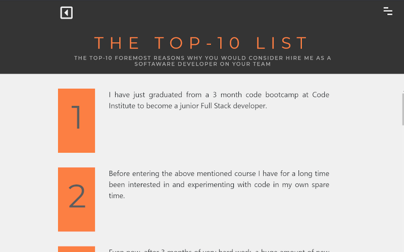

# HELLO MARK - SOME SORT OF RESUMÉ SITE

This is a resumé site, presenting myself as a potential employee. The main target is employers looking for full stack developers since this site is a part of my 3-months full stack developers course at Code Institute.

This is the first out of four projects we are to make individually during this course as part of the examination. This project is restricted to use only html and css, spiced with Bootstrap 4 or other resources we choose to use. I have spiced this one up a bit with not only Bootstrap 4 but also with other javascript driven features.

See deployed version <a href="https://ifooledme.github.io/Resume-Site--Code-Institute-Project-1/">HERE </a>

## FEATURES

There is not much to talk about regarding features since this site is informational only.

The index page is a full screen landing area. The user can click the "Top-10" button to get to a list with 10 points explaining why anyone would hire me.

In the top right corner is a hamburger menu icon that opens the site menu. This placement of the menu button follows all pages on the site.

All the sub-pages on the site use this structure with a header area, title, descriptive text, the menu button and a back-button to previous page.

The lower section of each page contains the content for each of the pages:

-   Top-10 list
-   Portfolio
-   Skills
-   Jobs
-   Educations
-   Contact

## USER STORIES

As a new visitor I wish to…

-   Understand what the page is about

As a potential employer I wish to...

-   See portfolio of past work done
-   See some summary of relevant skills
-   See job history
-   See educations and other certificates
-   Get contact information

## TECHNOLOGIES USED

-   HTML 5
-   CSS 3 (Bootstrap 4.5.0, Popper 16.0, fontawesome 5.13.1)
-   JAVASCRIPT (JQuery 3.5.1, popper 1.16.0, bootstrap 4.5.0)
-   Google Fonts
-   Font Awesome
-   GitHub for version control
-   Visual Studio Code 1.46.1 as IDE
-   Google Chrome 84.0.4147.89 (and development tool)
-   GIMP 2.10.14 for image manipulation

## DEPLOYMENT

The application is hosted on GitHub Pages: https://ifooledme.github.io/Resume-Site--Code-Institute-Project-1/

### GET A GITHUB REPOSITORY

The steps below require you to have a GitHub account where to push this project up to. If you don’t have one already, go here and follow the instructions for setting up a new account and install git bash locally on your computer locally in order to submit Git-commands in your terminal.

### HOW TO RUN THIS PROJECT LOCALLY

If you wish to deploy this project of your own take the following steps to clone this project to your own working directory:

1. In this repository (as you’re reading this readme in it :-) on the top right click the green “Code” button.
2. Copy the given url by clicking on the copy icon (or open it up with GitHub Desktop if you have it installed)
3. In your local IDE open Git Bash (or whatever terminal you use to work with Git)
4. Change the current working directory to the location where you want the clone to be created
5. In the terminal type “git clone” and the paste the url you just copied
   Press Enter. Your local clone will be created in the working directory you’re currently in

### PUSH THE PROJECT UPON A GIT REPOSITORY

If you wish to deploy the project on GitGub pages, first take the following steps:

1. In Git Bash (or any other terminal where you issue Git commands), go to the root directory of the project you just cloned (above)
   Then type “git init .”
2. Make some small changes to some file (for instance this readme file) in order to have something to commit and push to GitHub.
3. Then type command ‘ git add . ‘ to stage all files in the project for commit.
4. Then type command ‘ git commit -m “a message of you choosing” ‘
5. Then type command ‘ git push ‘ to push the project with all of it’s content to your git repository

### DEPLOY THE PROJECT ON GITHUB PAGES

To deploy the project on GitHub Pages take the following steps:

1. In your repository on GitHub, go to settings.
2. Choose menu option “Manage Access” and make the repository public (You will need to type your GitHub password to access this area)
3. Then scroll down a bit to the section GitHub Pages, and in the dropdown menu for “source”, currently saying “none”, select the branch “master”, leave the second dropdown as it is (on /(root))
4. Now click the save button and the top of the section should now say: “Your site is ready to be published at (web address)”.
5. At this web address you find your newly deployed project (note it might take a couple of minutes before the deployment takes effect).

## TESTING

The test is done manually in the following browsers:

-   Google Chrome 84.0.4147.89 (on PC Windows 10)
-   Microsoft Edge Chromium 84.0.522.44 (on PC Windows 10)
-   Firefox 78.0.2 (on PC Windows 10)
-   Safari (on iPad pro 10.5 iOS 13.6.1 with keyboard)

The testing is done from the perspective of each user story (presented above). Are they fullfilled and display propperly on different screen sizes? Besides that all links are tested manually on each page to ensure that they all work as intended.
